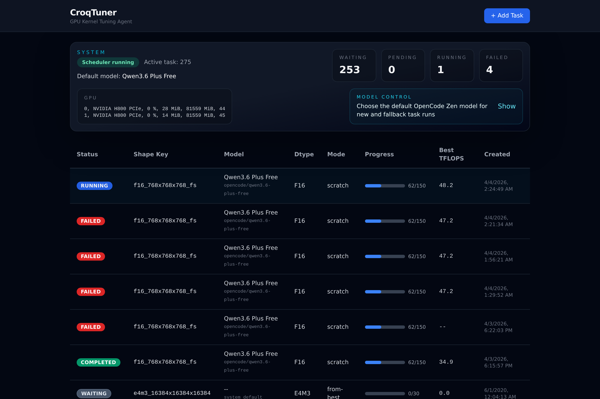
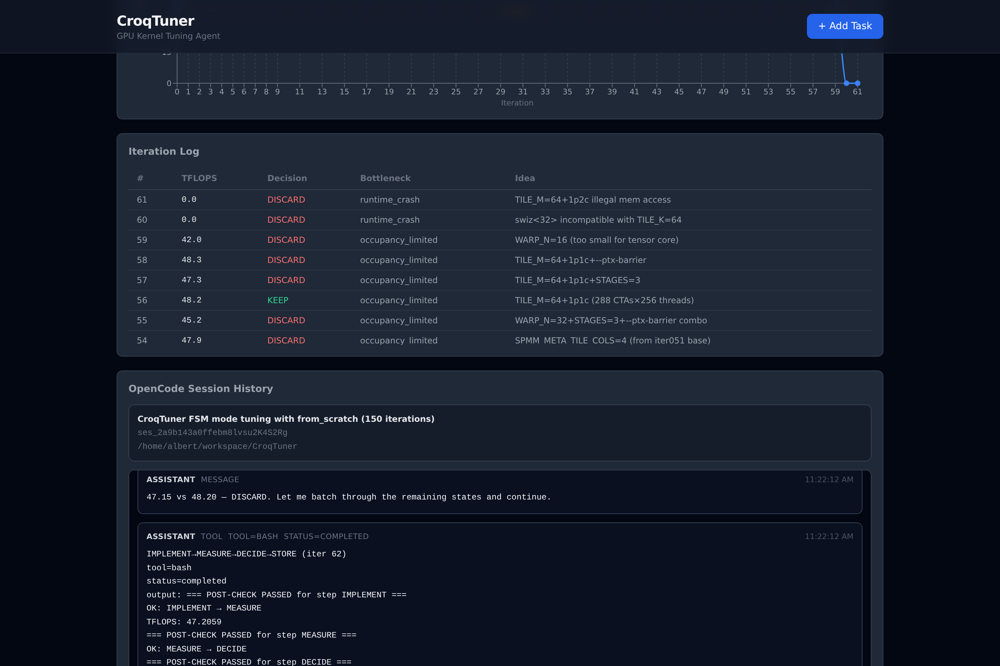
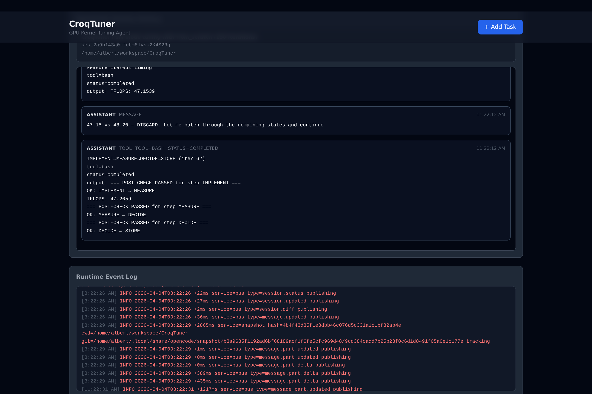
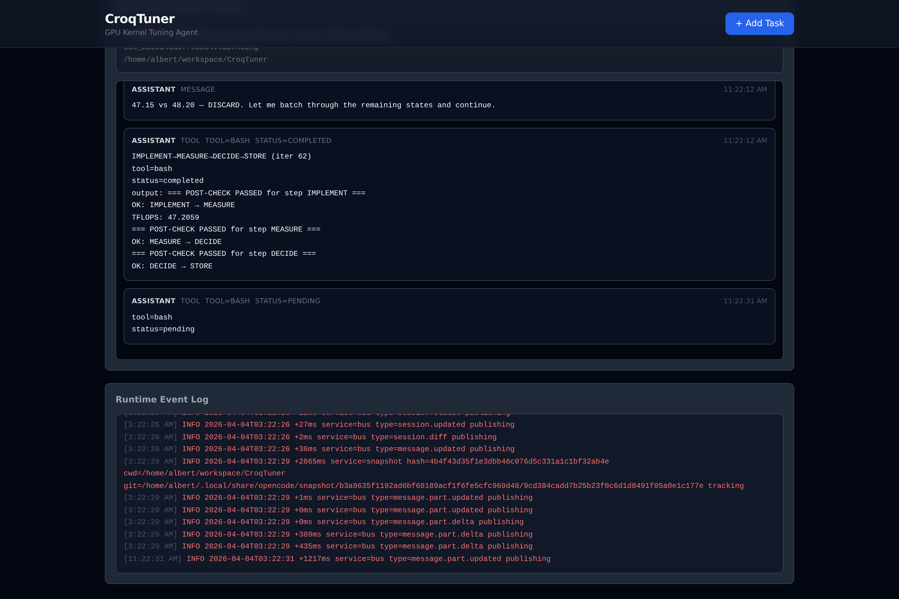

# CroqTuner Agent Bot

A lightweight, self-contained agent bot that manages GPU kernel tuning tasks through a web dashboard. It orchestrates [opencode](https://opencode.ai) to execute tuning using the CroqTuner FSM-driven skills from the croktile paper, providing real-time status updates.

## Screenshots

| Dashboard | Task Detail — TFLOPS Chart & Iteration Log |
|:-:|:-:|
|  |  |

| OpenCode Session History | Runtime Event Log |
|:-:|:-:|
|  |  |

## Architecture

```
┌─────────────────┐      REST + SSE      ┌──────────────────────┐
│   React SPA     │◄────────────────────►│   FastAPI Backend     │
│   (Vite + TW)   │                      │                      │
└─────────────────┘                      │  ┌──────────────┐    │
                                         │  │  Scheduler    │    │
                                         │  │  (heartbeat)  │    │
                                         │  └──────┬───────┘    │
                                         │         │            │
                                         │  ┌──────▼───────┐    │
                                         │  │  Agent        │    │
                                         │  │  (subprocess) │    │
                                         │  └──────┬───────┘    │
                                         └─────────┼────────────┘
                                                   │
                                         ┌─────────▼────────────┐
                                         │  opencode CLI        │
                                         │  (reads .claude/     │
                                         │   skills, writes     │
                                         │   tuning artifacts)  │
                                         └──────────────────────┘
```

## Prerequisites

- **Python** 3.10+ (backend)
- **Node.js** 20+ and npm (frontend; Vite 6 expects a recent Node)
- **opencode** CLI on `PATH` (for real tuning jobs), or use mock mode without it
- **Choreo / CUDA toolchain** on the host (see skills: `CHOREO_REPO` in the skill Markdown still points at your local choreo checkout — set in those files or via your environment if paths differ)

## What lives in this repo (self-contained)

`opencode run … <project_dir>` uses **`CroqTuner/` as `project_dir`** by default. That tree includes:

| Path | Role |
|------|------|
| **`.claude/skills/`** | CroqTuner FSM skills (`fsm-engine`, `ai-tune-from-current-best`, `ai-tune-from-scratch`, scripts) — same layout as Claude Code |
| **`kernels/`** | `manifest.json` and `gemm_sp_*` paths the skills reference |
| **`tuning/`** | `state.json`, `logs/`, `checkpoints/`, … (large; often **not** committed — see below) |

So skills are **inside** this project; you do not need a sibling `croktile_paper` checkout for path resolution. Skills still mention **`CHOREO_REPO=/home/.../choreo`** for `nvcc` / `choreo` — that is your local Choreo install, not this repo.

## Syncing from `croktile_paper` (optional)

If you keep developing in `croktile_paper` and want to refresh this repo’s copy:

```bash
./scripts/sync_paper_assets.sh ../croktile_paper   # or omit arg if sibling default fits
cd backend && source .venv/bin/activate && python ../scripts/seed_from_state.py
```

**Tuning-only mirror** (populate UI without refreshing skills):

```bash
rsync -a ../croktile_paper/tuning/ ./tuning/
cd backend && source .venv/bin/activate && python ../scripts/seed_from_state.py
```

The seed script reads `tuning/state.json`, creates one **Task** per shape, imports **`waiting`** (backlog), **`completed`** (done), and one **`pending`** row for the shape that was **`active`** in `state.json`. It also loads rows from each `tuning/logs/<shape>/results.tsv` into the iteration log table for charts.

- **`waiting`**: shown in the todo list; the scheduler **does not** start opencode until you open the task and click **Promote to queue** (status becomes **`pending`**).
- **`pending`**: eligible for the runner (FIFO).

Override paths only if you split directories across disks (`CROQTUNER_PROJECT_DIR`, etc.).

## Quick start (first time)

```bash
git clone git@github.com:codes1gn/CroqTuner.git
cd CroqTuner

cp .env.example .env
# Optional: only if you override defaults (skills/kernels/project are inside this repo)

cd backend && python3 -m venv .venv && source .venv/bin/activate && pip install -r requirements.txt && cd ..
cd frontend && npm install && cd ..
```

## Usage

### 1. Configuration (environment)

Copy [.env.example](.env.example) to `.env` at the **project root** and adjust paths. [`scripts/start.sh`](scripts/start.sh) `source`s that file before starting servers.

You can also set variables in the shell before `uvicorn` (see manual run). The backend reads **`CROQTUNER_*`** environment variables (see table below).

### 2. Start backend and frontend

**Option A — one command (from project root)**

```bash
./scripts/start.sh
```

- **Dashboard (UI):** http://localhost:5173  
- **API base:** http://localhost:8642/api  
- Vite proxies `/api` to the backend in dev, so opening the dashboard is enough for normal use.

**Option B — two terminals (manual)**

Backend (run from `backend/`; defaults use the CroqTuner repo root — only set `CROQTUNER_*` if you override locations):

```bash
cd backend
source .venv/bin/activate
mkdir -p ../data
# optional: export CROQTUNER_MOCK_MODE=1
uvicorn app.main:app --host 0.0.0.0 --port 8642
```

Frontend:

```bash
cd frontend
npm run dev -- --host 0.0.0.0 --port 5173
```

Use **http://localhost:5173** on the same machine, or **http://\<server-ip\>:5173** from another host on the LAN (ensure the firewall allows the port).

### 3. Using the dashboard

1. Open the UI URL in a browser.
2. Click **Add Task**, choose dtype (f16 / e4m3), **M**, **N**, **K**, and mode (*from current best* = 30 iter, *from scratch* = 150 iter, shape key gets `_fs` suffix).
3. Tasks run **one at a time** (FIFO). Watch the list and open a task for the TFLOPS chart, iteration table, and live agent log (SSE).
4. Optional checks:
   - `curl -s http://localhost:8642/api/health | jq` — scheduler, GPU summary via `nvidia-smi`
   - `GET /api/tasks` — queued and completed tasks

### 4. Mock mode (no opencode / no GPU)

For development or CI, point the agent at the simulator:

```bash
export CROQTUNER_MOCK_MODE=1
```

Then start the backend as above. See [`scripts/mock_opencode.py`](scripts/mock_opencode.py).

## Configuration

| Variable | Default | Description |
|----------|---------|-------------|
| `CROQTUNER_TUNING_DIR` | `<CroqTuner>/tuning` | Tuning artifacts; resolved from package location |
| `CROQTUNER_SKILLS_DIR` | `<CroqTuner>/.claude/skills` | CroqTuner skills bundled in this repo |
| `CROQTUNER_PROJECT_DIR` | `<CroqTuner>` (repo root) | Working directory for `opencode run` (contains `.claude/`, `kernels/`, `tuning/`) |
| `CROQTUNER_HEARTBEAT_SEC` | `30` | Scheduler poll interval (seconds) |
| `CROQTUNER_DB_PATH` | `./data/croqtuner.db` | SQLite DB (relative to the cwd when starting uvicorn, usually `backend/`) |
| `CROQTUNER_OPENCODE_BIN` | `opencode` | Path to the opencode executable |
| `CROQTUNER_MOCK_MODE` | `0` | `1` = run [`scripts/mock_opencode.py`](scripts/mock_opencode.py) instead of opencode |
| `CROQTUNER_PORT` | `8642` | API port (used by `start.sh`; pass `--port` to uvicorn manually if needed) |
| `CROQTUNER_HOST` | `0.0.0.0` | Bind address for `start.sh`’s uvicorn |

Override any path with an absolute value in `.env` if your directories are not in the default layout.

## Testing

```bash
# Run all tests
./scripts/test.sh

# Backend only
cd backend && source .venv/bin/activate && pytest tests/ -v

# Frontend only
cd frontend && npm test
```

Set `CROQTUNER_MOCK_MODE=1` to test without a GPU — the mock simulator writes fake iteration data.

## Project Structure

```
CroqTuner/
├── backend/
│   ├── app/
│   │   ├── main.py          # FastAPI app, routes, SSE
│   │   ├── models.py        # SQLAlchemy models (Task, IterationLog, AgentLog)
│   │   ├── database.py      # SQLite async engine
│   │   ├── scheduler.py     # Heartbeat loop, task dispatch
│   │   ├── agent.py         # opencode invocation + monitoring
│   │   ├── events.py        # SSE event bus
│   │   ├── schemas.py       # Pydantic request/response schemas
│   │   └── config.py        # Settings from env vars
│   ├── tests/
│   └── requirements.txt
├── frontend/
│   ├── src/
│   │   ├── App.tsx
│   │   ├── api.ts           # REST client
│   │   ├── components/      # TaskList, TaskDetail, AddTaskForm, etc.
│   │   └── hooks/useSSE.ts  # Server-Sent Events hook
│   └── package.json
├── .claude/skills/               # CroqTuner FSM + tuning skills (tracked; opencode reads these)
├── kernels/                      # `manifest.json` + `gemm_sp_*` (tracked)
├── scripts/
│   ├── start.sh                    # Launch backend + frontend (sources `.env`)
│   ├── test.sh                     # Backend + frontend test suites
│   ├── sync_paper_assets.sh        # rsync tuning + skills + kernels from `croktile_paper`
│   ├── seed_from_state.py          # Import tasks + iteration logs from `tuning/state.json` + `logs/*/results.tsv`
│   ├── mock_opencode.py            # Mock tuning loop (used when `CROQTUNER_MOCK_MODE=1`)
│   └── fix-opencode-permissions.sh # Diagnose `~/.opencode` root ownership (opencode EACCES)
├── tuning/                       # Large artifacts (gitignored by default; rsync or sync script)
├── .env.example
└── README.md
```

## How It Works

1. **User adds a task** via the web dashboard (dtype, M, N, K, mode).
2. **Scheduler picks it up** on the next heartbeat cycle (one task at a time — GPU is exclusive).
3. **Agent spawns opencode** with a prompt that explicitly references the CroqTuner skills:
   - `fsm-engine/SKILL.md` — the FSM router
   - `ai-tune-from-current-best/SKILL.md` or `ai-tune-from-scratch/SKILL.md`
4. **opencode runs autonomously**, following the FSM protocol: INIT → BASELINE → PROFILE → IDEATE → IMPLEMENT → MEASURE → DECIDE → STORE → repeat.
5. **Agent monitors** both opencode's stdout (regex parsing) and filesystem artifacts (checkpoints, results.tsv) to update progress in the database.
6. **Dashboard updates in real-time** via Server-Sent Events.

## Troubleshooting: opencode

If `opencode` prints JSON like `EACCES: permission denied, open '.../.opencode/package.json'`, the install tree under `~/.opencode` is often owned by **root** (e.g. a past `sudo` install). Fix once:

```bash
sudo chown -R "$(whoami):$(whoami)" ~/.opencode
```

Or run the checker:

```bash
bash scripts/fix-opencode-permissions.sh
```

If `opencode` is not found in a **login** shell (SSH), add `export PATH="$HOME/.opencode/bin:$PATH"` to `~/.profile` or `~/.bashrc`.
